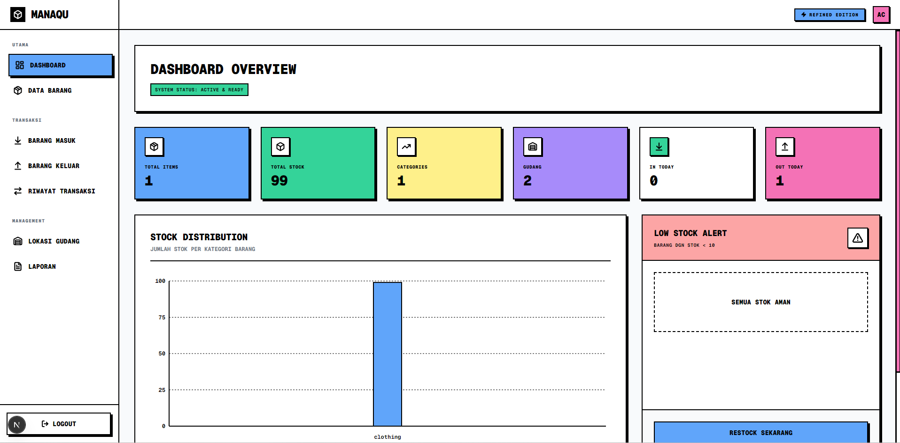

# ManaQu - Warehouse Management System



ManaQu adalah sistem manajemen gudang (Warehouse Management System) modern yang dirancang dengan antarmuka **Neo-Brutalism** yang berani dan profesional. Aplikasi ini memudahkan Anda untuk melacak inventaris, mengelola transaksi barang masuk dan keluar, serta memantau statistik gudang secara *real-time*.

## 🚀 Fitur Utama

- **Dashboard Interaktif & Real-time**: Memantau statistik gudang, distribusi stok, dan aktivitas transaksi harian.
- **Manajemen Inventaris (CRUD)**: Kelola data barang dengan mudah (Tambah, Edit, Hapus, dan Lihat detail).
- **Transaksi Inbound & Outbound**: Pencatatan barang masuk dan keluar yang terintegrasi langsung dengan stok barang.
- **Peringatan Stok Menipis (Low Stock Alert)**: Notifikasi otomatis untuk barang yang stoknya hampir habis.
- **Manajemen Gudang & Rak**: Pemetaan lokasi rak dan gudang secara spesifik.
- **Desain UI Neo-Brutalism**: Antarmuka yang unik, modern, dan profesional menggunakan Tailwind CSS.
- **Integrasi Scanner**: Mendukung pemindaian menggunakan QR Code (menggunakan HTML5 QR Code).
- **Grafik & Analitik**: Visualisasi data distribusi stok menggunakan Recharts.

## 🛠️ Teknologi yang Digunakan

Proyek ini dibangun menggunakan teknologi web modern:
- **Framework**: Next.js 16 (App Router) & React 19
- **Styling**: Tailwind CSS v4
- **Database & ORM**: Prisma ORM (dengan SQLite)
- **Animasi**: GSAP (GreenSock Animation Platform)
- **Chart**: Recharts
- **Icon**: Lucide React

## 💻 Panduan Instalasi (Lengkap)

Ikuti langkah-langkah berikut untuk menjalankan proyek ini di mesin lokal Anda:

### 1. Kloning Repositori
```bash
git clone https://github.com/AzzamCyber/mana-qu.git
cd mana-qu
```

### 2. Instalasi Dependensi
Pastikan Anda sudah menginstal **Node.js** (minimal versi 18). Jalankan perintah berikut untuk menginstal semua package yang dibutuhkan:
```bash
npm install
```

### 3. Konfigurasi Database
Aplikasi ini menggunakan Prisma dengan SQLite secara bawaan untuk kemudahan pengembangan.
Buat file `.env` di root folder proyek (jika belum ada) dan tambahkan URL database:
```env
DATABASE_URL="file:./dev.db"
```

Jalankan migrasi Prisma untuk membuat struktur tabel di database:
```bash
npx prisma generate
npx prisma db push
```
*(Opsional) Jika Anda memiliki file seed untuk data dummy, jalankan `npx prisma db seed`.*

### 4. Menjalankan Server Pengembangan (Development)
```bash
npm run dev
```

Buka [http://localhost:3000](http://localhost:3000) di browser Anda untuk melihat hasilnya.

### 5. Build untuk Produksi (Production)
Untuk menjalankan aplikasi dalam mode produksi:
```bash
npm run build
npm run start
```

## 👨‍💻 Kredit Pengembang

Proyek ini dikembangkan dengan sepenuh hati oleh:
**AZZAM CODEX**
*Fullstack Web Developer & UI/UX Enthusiast*

---
*Silakan beri ⭐ (star) pada repository ini jika Anda merasa proyek ini bermanfaat!*
